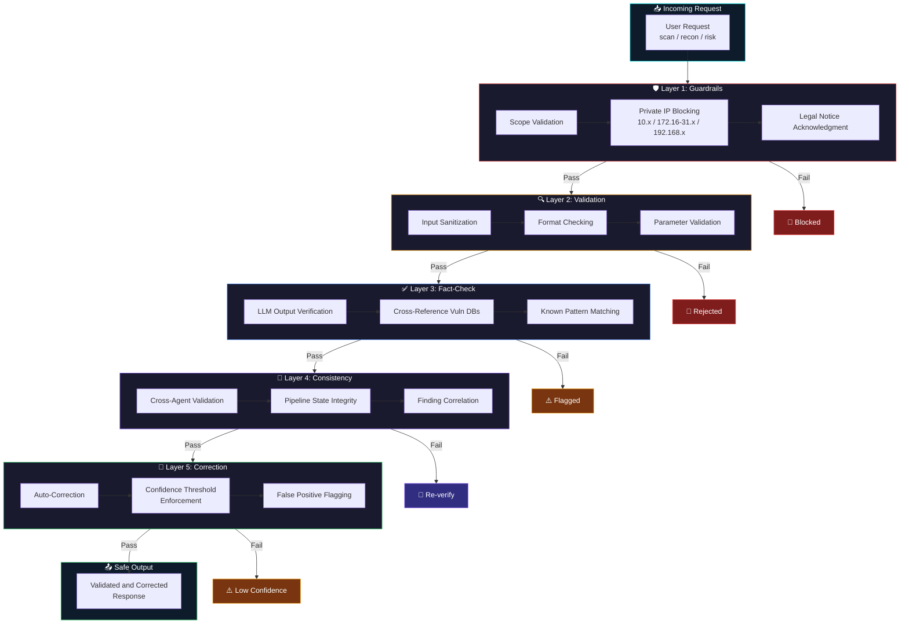
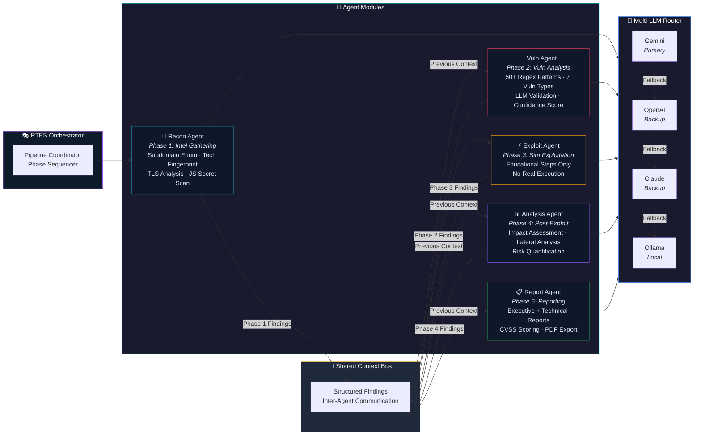
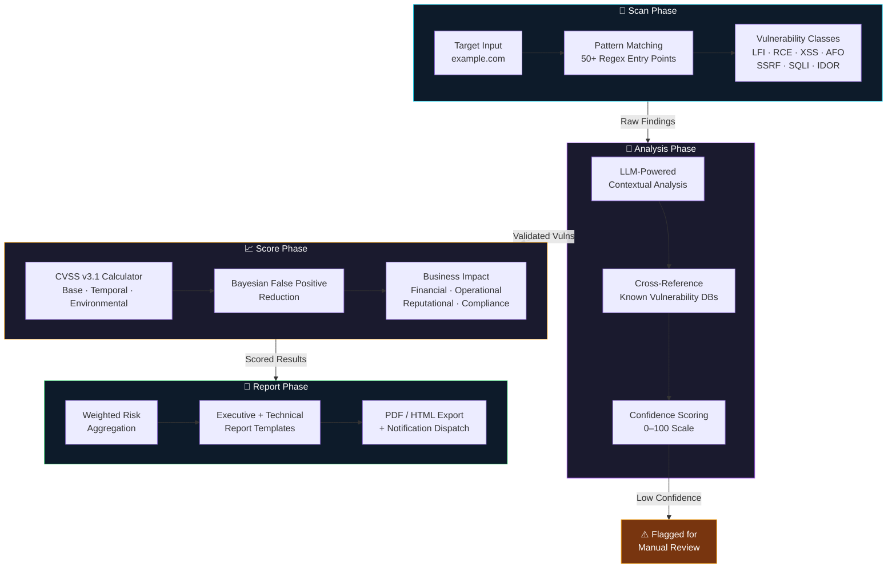
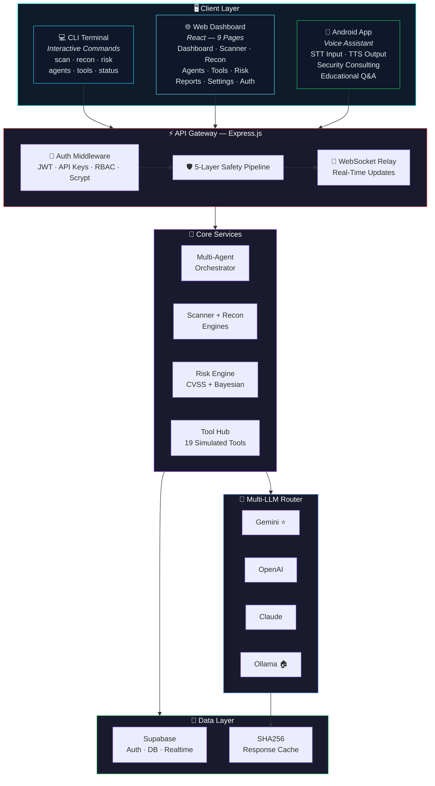

<a href="https://github.com/mulkymalikuldhrs/cyber-shell-x-nexus">
  
</a>

<div align="center">

[](https://git.io/typing-svg)

<br/>

[](https://github.com/mulkymalikuldhrs/cyber-shell-x-nexus)
[](https://github.com/mulkymalikuldhrs/cyber-shell-x-nexus)
[](https://github.com/mulkymalikuldhrs/cyber-shell-x-nexus)
[](https://github.com/mulkymalikuldhrs/cyber-shell-x-nexus)
[](https://github.com/mulkymalikuldhrs/cyber-shell-x-nexus/releases)
[](LICENSE)

<br/>

[](https://www.npmjs.com/package/cybershell-x-nexus)
[](https://www.npmjs.com/package/cybershell-x-nexus)
[](https://github.com/mulkymalikuldhrs/cyber-shell-x-nexus/stargazers)
[](https://github.com/mulkymalikuldhrs/cyber-shell-x-nexus/fork)
[](https://github.com/mulkymalikuldhrs/cyber-shell-x-nexus/issues)
[](https://github.com/mulkymalikuldhrs/cyber-shell-x-nexus/pulls)

<br/>

**Language / Bahasa / 语言**

[](README.md)
[](README_id.md)
[](README_zh.md)

</div>

---

## Overview

CyberShellX Nexus is an **AI-assisted cybersecurity platform** designed for education and authorized testing. It integrates multi-agent orchestration, multi-LLM intelligence, vulnerability scanning, reconnaissance engines, and risk assessment into a single unified system. Built with TypeScript and React, it provides cybersecurity professionals, students, and enthusiasts with an intelligent companion for security assessment methodology, vulnerability research, and learning.

The platform operates across three interfaces: a CLI terminal, a browser-based web dashboard with 9 dedicated pages for scanning, reconnaissance, agent monitoring, tool management, risk assessment, and reporting — plus an Android voice assistant. Each interface connects to the same AI-powered backend.

> **Important**: All tool executions are **simulated** for educational purposes. No actual attacks are performed. This is not an autonomous hacking system — it is an AI-assisted analysis and education platform.

---

## Key Features at a Glance

| Feature | Description |
|---|---|
| **Multi-Agent Orchestration** | 5 specialized AI agents (Recon, Vuln, Exploit, Analysis, Report) coordinating through a PTES 5-phase pipeline |
| **Multi-LLM AI Router** | Gemini, OpenAI, Claude, Ollama with priority fallback chain, SHA256 caching, and automatic provider switching |
| **Vulnerability Scanner** | 50+ regex patterns, 7 vulnerability types, LLM-powered analysis with confidence scoring |
| **Reconnaissance Engine** | 20+ passive subdomain sources, TLS fingerprinting, JS secret scanning, security headers |
| **Risk Engine** | CVSS v3.1 scoring, Bayesian false positive reduction, business impact calculator |
| **5-Layer Safety Pipeline** | Guardrails → Validation → Fact-check → Consistency → Correction with scope validation |
| **Security Tool Hub** | 19 tools with 3 safety levels (Safe, Moderate, Restricted) and simulated execution |
| **Authentication System** | JWT tokens, scrypt password hashing, API key management, role-based access |
| **Notification System** | Real-time WebSocket relay with Discord, Slack, Telegram, and Email webhook support |

---

## What's New in v3.0

### Multi-LLM Provider System

The platform supports multiple LLM providers with intelligent routing:

- **4 Providers**: Google Gemini (primary), OpenAI GPT, Anthropic Claude, Ollama (local)
- **Priority Fallback Chain**: If the primary provider fails, the system automatically falls back to the next available provider
- **SHA256 Response Caching**: Identical prompts are cached with SHA256 hash keys to reduce API costs and improve response times
- **Automatic Provider Switching**: Health-check pings determine provider availability before routing requests
- **Unified Interface**: All providers share a common `LLMProvider` interface, making it straightforward to add new providers

### Multi-Agent Orchestration

Five specialized AI agents coordinate through a PTES (Penetration Testing Execution Standard) 5-phase pipeline:

| Agent | Phase | Responsibility |
|---|---|---|
| **Recon Agent** | Phase 1: Intelligence Gathering | Passive reconnaissance, subdomain enumeration, tech fingerprinting |
| **Vuln Agent** | Phase 2: Vulnerability Analysis | Pattern-based scanning, LLM-assisted vulnerability classification |
| **Exploit Agent** | Phase 3: Exploitation (Simulated) | Generates simulated exploitation steps for educational analysis |
| **Analysis Agent** | Phase 4: Post-Exploitation Analysis | Impact assessment, lateral movement analysis, risk quantification |
| **Report Agent** | Phase 5: Reporting | Executive and technical report generation with CVSS scoring |

Agents communicate through a shared context bus, passing structured findings between phases. Each agent validates scope before executing any analysis.

### Vulnerability Scanner

The scanner combines regex pattern matching with LLM-powered analysis:

- **50+ Regex Entry Points**: Pattern matching for common vulnerability indicators across 7 vulnerability classes
- **7 Vulnerability Types**: LFI, RCE, XSS, AFO (Arbitrary File Operations), SSRF, SQLI, IDOR
- **Confidence Scoring**: Each finding includes a confidence score (0–100) based on pattern match quality and LLM cross-validation
- **LLM-Powered Analysis**: After initial pattern matching, the LLM validates and enriches findings with contextual analysis
- **False Positive Flagging**: Low-confidence matches are flagged for manual review

> **Note**: The scanner uses static pattern matching and LLM analysis — it does not perform runtime exploitation or active payload injection.

### Reconnaissance Engine

Passive information gathering from 20+ sources:

- **20+ Passive Subdomain Sources**: crt.sh, VirusTotal, SecurityTrails, DNSDumpster, Shodan, and more (simulated API responses)
- **TLS Fingerprinting**: Identifies 25+ TLS vendor implementations from certificate analysis
- **JS Secret Scanning**: 22 regex patterns for detecting accidentally exposed API keys, tokens, and credentials in JavaScript files
- **Security Header Checking**: Evaluates HTTP security headers (CSP, HSTS, X-Frame-Options, etc.)
- **Technology Fingerprinting**: Identifies web frameworks, CMS platforms, and server technologies

> **Note**: Reconnaissance data is simulated for educational demonstration. The engine demonstrates methodology rather than performing live enumeration.

### Security Tool Integration Hub

19 security tools organized across 3 safety levels:

| Safety Level | Tools | Behavior |
|---|---|---|
| **Safe** | nmap (syn scan), dig, whois, curl, whatweb, nikto | Information gathering only |
| **Moderate** | nuclei, sqlmap (detection mode), ffuf, gobuster, dirb, wpscan, hydra (limited) | Detection with safety guards |
| **Restricted** | metasploit, burpsuite, john, hashcat, aircrack-ng, bettercap | Simulated execution only |

> **Note**: All tool executions are simulated. The platform generates representative output to demonstrate tool behavior and teach methodology — no actual commands are executed on target systems.

### Risk Engine

Comprehensive risk assessment with industry-standard scoring:

- **CVSS v3.1 Scoring**: Calculates Base, Temporal, and Environmental CVSS scores for each vulnerability finding
- **Bayesian False Positive Reduction**: Uses Bayesian probability to reduce false positive rates by cross-referencing multiple data sources
- **Business Impact Calculator**: Translates technical CVSS scores into business impact categories (Financial, Operational, Reputational, Compliance)
- **Weighted Risk Scoring**: Aggregates individual vulnerability scores into an overall risk rating with configurable weight factors

### 5-Layer Safety Pipeline

Every request passes through 5 validation layers before and after processing:

```
Layer 1: Guardrails     → Scope validation, private IP blocking, legal notice acknowledgment
Layer 2: Validation     → Input sanitization, format checking, parameter validation
Layer 3: Fact-check     → LLM output verification against known vulnerability databases
Layer 4: Consistency    → Cross-agent consistency validation, pipeline state integrity
Layer 5: Correction     → Auto-correction of misclassifications, confidence threshold enforcement
```

- **Private IP Blocking**: The safety pipeline blocks analysis of private/internal IP addresses (10.x.x.x, 172.16-31.x.x, 192.168.x.x)
- **Legal Notice**: Users must acknowledge authorization before any analysis begins
- **Scope Validation**: Target scope is validated before each agent phase

### Authentication System

- **JWT Tokens**: Short-lived access tokens with refresh token rotation
- **Scrypt Password Hashing**: Memory-hard key derivation for secure password storage
- **API Key Management**: Generate, revoke, and rotate API keys with permission scopes
- **Role-Based Access Control**: Three roles — `admin` (full access), `analyst` (scan + report), `user` (view only)

### Notification System

Real-time alerts via multiple channels:

- **Discord Webhooks**: Rich embed notifications with scan results and severity indicators
- **Slack Webhooks**: Block-formatted messages with action buttons for triage
- **Telegram Bot API**: Message notifications with inline keyboards for quick response
- **Email (SMTP)**: HTML-formatted reports with summary statistics
- **WebSocket Relay**: Live scan progress, agent status updates, and tool execution events pushed to all connected clients

### Enhanced Web Dashboard

9 dedicated pages in the web interface:

| Page | Description |
|---|---|
| **Dashboard** | Overview with active scans, recent findings, risk summary, and agent status |
| **Scanner** | Vulnerability scanner interface with target input, scan configuration, and live results |
| **Recon** | Reconnaissance engine with subdomain discovery, TLS analysis, and tech fingerprinting |
| **Agents** | Multi-agent monitoring with real-time phase progress and inter-agent communication |
| **Tools** | Security tool hub with categorized tools, safety levels, and simulated execution console |
| **Risk** | Risk assessment dashboard with CVSS scores, business impact, and false positive analysis |
| **Reports** | Report generation with executive and technical templates, PDF export |
| **Settings** | LLM provider configuration, API key management, notification channels, user roles |
| **Auth** | Login, registration, password reset, and API key management |

---

## Visual Architecture

> Interactive Mermaid diagrams showing system internals, data flows, and honest project status.

### 1. 5-Layer Safety Pipeline

Every request flows through five sequential safety checks before and after AI processing:



### 2. Multi-Agent Security Architecture

Five specialized AI agents coordinate through a PTES 5-phase pipeline with a shared context bus:



### 3. Threat Detection Flow

From initial scan to scored report — the complete vulnerability detection lifecycle:



### 4. Multi-Platform Architecture

Three interfaces connect to the same AI-powered backend:



### 5. Honest Status — Simulated vs Real

Full transparency on what is simulated and what is real execution:

```mermaid
flowchart LR
    subgraph SIMULATED["🎬 SIMULATED — No Real Execution"]
        direction TB
        S1["🛡️ Tool Execution<br/><i>nmap, sqlmap, nuclei...</i><br/>Generated representative output<br/>No actual commands run"]
        S2["📡 Recon Sources<br/><i>crt.sh, Shodan, VT...</i><br/>Simulated API responses<br/>Demonstrates methodology"]
        S3["⚡ Exploit Steps<br/><i>Metasploit, Burp...</i><br/>Educational descriptions only<br/>No payloads delivered"]
        S4["🔐 Android Assistant<br/><i>Voice consulting</i><br/>Answers security questions<br/>No on-device attacks"]
    end

    subgraph REAL["✅ REAL — Actual Execution"]
        direction TB
        R1["🧠 LLM AI Analysis<br/><i>Gemini / OpenAI / Claude</i><br/>Real API calls with caching<br/>Actual AI reasoning"]
        R2["📊 CVSS Scoring<br/><i>v3.1 Calculator</i><br/>Mathematical scoring<br/>Real algorithm"]
        R3["🔑 Authentication<br/><i>JWT + Scrypt + RBAC</i><br/>Real token management<br/>Actual password hashing"]
        R4["🔔 Notifications<br/><i>Discord / Slack / Email</i><br/>Real webhook dispatch<br/>Actual message delivery"]
    end

    SIMULATED ~~~ REAL

    style SIMULATED fill:#7f1d1d,stroke:#ef4444,color:#fff
    style REAL fill:#14532d,stroke:#22c55e,color:#fff
    style S1 fill:#991b1b,stroke:#f87171,color:#fecaca
    style S2 fill:#991b1b,stroke:#f87171,color:#fecaca
    style S3 fill:#991b1b,stroke:#f87171,color:#fecaca
    style S4 fill:#991b1b,stroke:#f87171,color:#fecaca
    style R1 fill:#166534,stroke:#4ade80,color:#dcfce7
    style R2 fill:#166534,stroke:#4ade80,color:#dcfce7
    style R3 fill:#166534,stroke:#4ade80,color:#dcfce7
    style R4 fill:#166534,stroke:#4ade80,color:#dcfce7
```



> **Bottom line**: The AI analysis, scoring, auth, and notifications are real. All tool execution, reconnaissance, and exploitation is simulated for education. This is not an autonomous hacking system.

---

## Sources and Attribution

This project integrates concepts, architectures, and implementations derived from the following open-source projects. Full credit goes to the original authors.

| Source Project | Original Author | What Was Integrated | License |
|---|---|---|---|
| [vulnhuntr](https://github.com/protectai/vulnhuntr) | Protect AI (Dan McInerney, Marcello Salvati) | Multi-LLM abstraction pattern, iterative context-enriched vulnerability analysis, 50+ entry point regex patterns, 7 vulnerability class analyzers, confidence scoring | AGPL-3.0 |
| [Zen-AI-Pentest](https://github.com/mulkymalikuldhrs/Zen-AI-Pentest) | Mulky Malikul Dhaher | Multi-agent system, tool registry + executor, 5-layer safety pipeline, risk engine with CVSS scoring, false positive reduction, business impact calculator | MIT |
| [god-eye](https://github.com/mulkymalikuldhrs/god-eye) | Vyntral / Orizon | Passive subdomain enumeration, TLS fingerprinting, JS secret scanning patterns, security header checking, tech fingerprinting | MIT |
| [WifiToolX](https://github.com/mulkymalikuldhrs/WifiToolX) | Mulky Malikul Dhaher | WebSocket command relay architecture, AI password candidate generation concept, glassmorphism UI theme | MIT |
| [BruteForceAI](https://github.com/MorDavid/BruteForceAI) | Mor David | Webhook notification implementations (Discord, Slack, Telegram), smart HTML extraction pattern | Non-Commercial |
| [unshackle](https://github.com/Fadi002/unshackle) | Fadi002 | Partition discovery concept (not directly integrated — password bypass tools are not included) | GPL-3.0 |
| [Shannon](https://github.com/KeygraphHQ/shannon) | Keygraph | Multi-agent orchestration pipeline concept, "No Exploit, No Report" validation gate concept | AGPL-3.0 |
| [PentestGPT](https://github.com/GreyDGL/PentestGPT) | GreyDGL | Pentesting Task Tree state representation concept, tripartite module architecture, multi-LLM provider registry concept | MIT |

> **Important**: All implementations have been **rewritten in TypeScript** from the original Python/Go implementations. No source code was copied verbatim. Concepts and architectural patterns have been adapted to fit the CyberShellX Nexus architecture.

---

## Honest Notes

> We believe in transparency. Here are important limitations and clarifications about this project.

- All tool executions are **simulated** — no actual network attacks are performed
- The vulnerability scanner uses **pattern matching and LLM analysis**, not runtime exploitation or active payload injection
- The reconnaissance engine **simulates passive source enumeration** for educational demonstration of methodology
- Multi-agent system coordinates AI agents for **analysis workflow**, not autonomous hacking — each agent validates scope and operates within safety guardrails
- The Android voice assistant provides **security consulting and educational guidance**, not on-device attack capabilities
- This is **not** an autonomous hacking system — human oversight is required at every stage
- LLM-generated findings may contain **false positives** — always verify results independently

---

## Installation

### Prerequisites

- **Node.js** >= 18.x
- **npm** >= 9.x
- **Git** >= 2.x
- **LLM API Key** (at least one): Google Gemini, OpenAI, Anthropic Claude, or Ollama (local)
- **Termux** (for Android setup)

### Quick Start

```bash
# Clone the repository

<!-- AUTO-PACKAGE-BADGES:START -->
<!-- Auto-generated package badges -->

   [](https://www.npmjs.com/package/cybershell-x-nexus)

<!-- AUTO-PACKAGE-BADGES:END -->
git clone https://github.com/mulkymalikuldhrs/cyber-shell-x-nexus.git
cd cyber-shell-x-nexus

# Install dependencies
npm install

# Configure environment
cp .env.example .env
# Edit .env with your API keys (see Environment Variables below)

# Launch the platform
./launcher.sh
```

### Launch Modes

```bash
./launcher.sh cli       # CLI terminal interface
./launcher.sh web       # Web dashboard (default: http://localhost:3000)
./launcher.sh android   # Android voice assistant mode
./launcher.sh update    # Update to latest version
./launcher.sh status    # Check system status and service health
```

### Termux Setup (Android)

```bash
# Install Termux from F-Droid (recommended) or Google Play
# Update packages
pkg update && pkg upgrade

# Install required packages
pkg install nodejs git

# Clone and setup
git clone https://github.com/mulkymalikuldhrs/cyber-shell-x-nexus.git
cd cyber-shell-x-nexus
npm install
cp .env.example .env

# Launch in Android mode
./launcher.sh android
```

### Environment Variables

Create a `.env` file in the project root:

```env
# ─── LLM Provider Keys ───────────────────────────────────
GEMINI_API_KEY=your_gemini_api_key_here
OPENAI_API_KEY=your_openai_api_key_here
CLAUDE_API_KEY=your_claude_api_key_here
OLLAMA_BASE_URL=http://localhost:11434

# ─── LLM Configuration ───────────────────────────────────
LLM_PRIMARY_PROVIDER=gemini
LLM_FALLBACK_CHAIN=gemini,openai,claude,ollama
LLM_CACHE_ENABLED=true
LLM_CACHE_TTL=3600

# ─── Server Configuration ────────────────────────────────
PORT=3000
HOST=0.0.0.0
NODE_ENV=production

# ─── Authentication ──────────────────────────────────────
JWT_SECRET=your_jwt_secret_here_min_32_chars
JWT_EXPIRY=1h
JWT_REFRESH_EXPIRY=7d
SCRYPT_COST_FACTOR=16384

# ─── Webhook Notifications ───────────────────────────────
DISCORD_WEBHOOK_URL=
SLACK_WEBHOOK_URL=
TELEGRAM_BOT_TOKEN=
TELEGRAM_CHAT_ID=
SMTP_HOST=
SMTP_PORT=587
SMTP_USER=
SMTP_PASS=
EMAIL_FROM=

# ─── Safety Configuration ────────────────────────────────
SAFETY_BLOCK_PRIVATE_IPS=true
SAFETY_REQUIRE_AUTH_ACK=true
SAFETY_MAX_CONFIDENCE_THRESHOLD=85

# ─── Logging ─────────────────────────────────────────────
LOG_LEVEL=info
LOG_FILE=logs/cybershellx.log
```

---

## Usage

### CLI Commands

```bash
# Start an interactive session
cybershellx scan --target example.com --type full

# Run vulnerability scan only
cybershellx scan --target example.com --type vuln

# Run reconnaissance only
cybershellx recon --target example.com --sources all

# Run risk assessment
cybershellx risk --target example.com --format json

# Generate report
cybershellx report --target example.com --template executive --output report.pdf

# Check agent status
cybershellx agents --status

# Manage tools
cybershellx tools --list
cybershellx tools --run nmap --target example.com --flags "-sV"

# System status
cybershellx status
```

### Web Interface

Access the web dashboard at `http://localhost:3000` after running `./launcher.sh web`. The dashboard provides 9 pages:

| Page | Path | Description |
|---|---|---|
| Dashboard | `/` | Overview with active scans, recent findings, risk summary, and agent status tiles |
| Scanner | `/scanner` | Vulnerability scanner with target input, scan type selection, live results stream |
| Recon | `/recon` | Reconnaissance engine with subdomain discovery, TLS certificates, tech stack analysis |
| Agents | `/agents` | Multi-agent monitor showing real-time PTES phase progress and inter-agent messaging |
| Tools | `/tools` | Security tool hub with 19 categorized tools, safety badges, simulated console output |
| Risk | `/risk` | Risk assessment dashboard with CVSS v3.1 scorecards, impact heatmaps, FP analysis |
| Reports | `/reports` | Report builder with executive and technical templates, PDF/HTML export |
| Settings | `/settings` | LLM provider config, API key rotation, notification channel setup, role management |
| Auth | `/auth` | Login, registration, password management, API key generation |

### Android App

The Android voice assistant provides security consulting through natural language:

```
You: "What are common XSS vectors in React applications?"
Assistant: Explains XSS vectors relevant to React...

You: "Explain the CVSS 3.1 scoring for an SSRF vulnerability"
Assistant: Breaks down CVSS metrics for SSRF...

You: "What reconnaissance steps should I take for a web app assessment?"
Assistant: Outlines PTES Phase 1 methodology...
```

> The Android assistant provides **educational consulting only** — it does not perform attacks or execute tools on the device.

---

## Project Structure

```
cyber-shell-x-nexus/
├── launcher.sh                    # Platform launcher script
├── package.json                   # Project manifest
├── tsconfig.json                  # TypeScript configuration
├── .env.example                   # Environment variable template
├── LICENSE                        # MIT License
├── README.md                      # This file
│
├── src/
│   ├── index.ts                   # Application entry point
│   │
│   ├── agents/                    # Multi-Agent Orchestration
│   │   ├── base-agent.ts          # Abstract agent base class
│   │   ├── recon-agent.ts         # Phase 1: Intelligence Gathering
│   │   ├── vuln-agent.ts          # Phase 2: Vulnerability Analysis
│   │   ├── exploit-agent.ts       # Phase 3: Simulated Exploitation
│   │   ├── analysis-agent.ts      # Phase 4: Post-Exploitation Analysis
│   │   ├── report-agent.ts        # Phase 5: Reporting
│   │   ├── orchestrator.ts        # PTES pipeline coordinator
│   │   └── context-bus.ts         # Inter-agent communication bus
│   │
│   ├── llm/                       # Multi-LLM Provider System
│   │   ├── provider-interface.ts  # Unified LLMProvider interface
│   │   ├── gemini-provider.ts     # Google Gemini adapter
│   │   ├── openai-provider.ts     # OpenAI GPT adapter
│   │   ├── claude-provider.ts     # Anthropic Claude adapter
│   │   ├── ollama-provider.ts     # Ollama local provider adapter
│   │   ├── router.ts              # Priority fallback router
│   │   ├── cache.ts               # SHA256 response cache
│   │   └── health-check.ts        # Provider availability monitor
│   │
│   ├── scanner/                   # Vulnerability Scanner
│   │   ├── engine.ts              # Scanner orchestration engine
│   │   ├── patterns.ts            # 50+ regex entry point patterns
│   │   ├── analyzers/             # 7 vulnerability class analyzers
│   │   │   ├── lfi.ts             # Local File Inclusion
│   │   │   ├── rce.ts             # Remote Code Execution
│   │   │   ├── xss.ts             # Cross-Site Scripting
│   │   │   ├── afo.ts             # Arbitrary File Operations
│   │   │   ├── ssrf.ts            # Server-Side Request Forgery
│   │   │   ├── sqli.ts            # SQL Injection
│   │   │   └── idor.ts            # Insecure Direct Object Reference
│   │   └── confidence.ts          # Confidence scoring engine
│   │
│   ├── recon/                     # Reconnaissance Engine
│   │   ├── engine.ts              # Recon orchestration engine
│   │   ├── subdomain.ts           # 20+ passive subdomain sources
│   │   ├── tls-fingerprint.ts     # TLS certificate analysis
│   │   ├── js-secret-scan.ts      # 22 JS secret regex patterns
│   │   ├── headers.ts             # Security header evaluation
│   │   └── tech-fingerprint.ts    # Technology identification
│   │
│   ├── risk/                      # Risk Engine
│   │   ├── cvss.ts                # CVSS v3.1 calculator
│   │   ├── bayesian-fp.ts         # Bayesian false positive reduction
│   │   ├── business-impact.ts     # Business impact calculator
│   │   └── weighted-score.ts      # Weighted risk aggregation
│   │
│   ├── safety/                    # 5-Layer Safety Pipeline
│   │   ├── guardrails.ts          # Layer 1: Scope validation
│   │   ├── validation.ts          # Layer 2: Input sanitization
│   │   ├── fact-check.ts          # Layer 3: Output verification
│   │   ├── consistency.ts         # Layer 4: Cross-agent consistency
│   │   └── correction.ts          # Layer 5: Auto-correction
│   │
│   ├── tools/                     # Security Tool Hub
│   │   ├── registry.ts            # Tool registration and lookup
│   │   ├── executor.ts            # Simulated tool execution engine
│   │   ├── safety-levels.ts       # Safe / Moderate / Restricted tiers
│   │   └── tools/                 # Individual tool adapters
│   │       ├── nmap.ts
│   │       ├── nuclei.ts
│   │       ├── sqlmap.ts
│   │       ├── ffuf.ts
│   │       ├── gobuster.ts
│   │       ├── nikto.ts
│   │       ├── hydra.ts
│   │       ├── metasploit.ts
│   │       ├── burpsuite.ts
│   │       └── ...                # 19 total tool adapters
│   │
│   ├── auth/                      # Authentication System
│   │   ├── jwt.ts                 # JWT token management
│   │   ├── scrypt.ts              # Scrypt password hashing
│   │   ├── api-keys.ts            # API key generation and validation
│   │   ├── roles.ts               # Role-based access control
│   │   └── middleware.ts          # Express auth middleware
│   │
│   ├── notifications/             # Notification System
│   │   ├── dispatcher.ts          # Notification router
│   │   ├── discord.ts             # Discord webhook integration
│   │   ├── slack.ts               # Slack webhook integration
│   │   ├── telegram.ts            # Telegram Bot API integration
│   │   ├── email.ts               # SMTP email integration
│   │   └── websocket.ts           # WebSocket real-time relay
│   │
│   ├── server/                    # Express Backend
│   │   ├── app.ts                 # Express application setup
│   │   ├── routes.ts              # API route definitions
│   │   └── middleware.ts          # Request processing middleware
│   │
│   ├── web/                       # React Frontend
│   │   ├── App.tsx                # Root application component
│   │   ├── index.tsx              # React entry point
│   │   ├── pages/                 # 9 dashboard pages
│   │   │   ├── Dashboard.tsx
│   │   │   ├── Scanner.tsx
│   │   │   ├── Recon.tsx
│   │   │   ├── Agents.tsx
│   │   │   ├── Tools.tsx
│   │   │   ├── Risk.tsx
│   │   │   ├── Reports.tsx
│   │   │   ├── Settings.tsx
│   │   │   └── Auth.tsx
│   │   ├── components/            # Shared UI components
│   │   └── styles/                # Glassmorphism theme styles
│   │
│   └── android/                   # Android Voice Assistant
│       ├── assistant.ts           # Voice processing handler
│       ├── speech-to-text.ts      # STT integration
│       └── text-to-speech.ts      # TTS integration
│
├── logs/                          # Application logs
├── reports/                       # Generated reports output
└── tests/                         # Test suites
    ├── agents/
    ├── scanner/
    ├── recon/
    ├── risk/
    ├── safety/
    └── integration/
```

---

## API Reference

| Method | Path | Description |
|---|---|---|
| `POST` | `/api/auth/register` | Register a new user account |
| `POST` | `/api/auth/login` | Authenticate and receive JWT tokens |
| `POST` | `/api/auth/refresh` | Refresh an expired access token |
| `POST` | `/api/auth/logout` | Invalidate current session |
| `POST` | `/api/auth/password-reset` | Request a password reset email |
| `GET` | `/api/auth/me` | Get current user profile |
| `GET` | `/api/keys` | List user API keys |
| `POST` | `/api/keys` | Generate a new API key |
| `DELETE` | `/api/keys/:id` | Revoke an API key |
| `POST` | `/api/scan/start` | Start a new vulnerability scan |
| `GET` | `/api/scan/:id/status` | Get scan progress and status |
| `GET` | `/api/scan/:id/results` | Retrieve completed scan results |
| `DELETE` | `/api/scan/:id` | Cancel an active scan |
| `GET` | `/api/scan/history` | List past scan sessions |
| `POST` | `/api/recon/start` | Start a reconnaissance session |
| `GET` | `/api/recon/:id/status` | Get recon session progress |
| `GET` | `/api/recon/:id/subdomains` | Get discovered subdomains |
| `GET` | `/api/recon/:id/tls` | Get TLS fingerprint results |
| `GET` | `/api/recon/:id/secrets` | Get JS secret scanning results |
| `GET` | `/api/recon/:id/headers` | Get security header analysis |
| `GET` | `/api/recon/:id/tech` | Get technology fingerprint results |
| `GET` | `/api/agents/status` | Get all agent statuses |
| `GET` | `/api/agents/:agent/history` | Get agent execution history |
| `POST` | `/api/agents/orchestrate` | Start PTES pipeline orchestration |
| `GET` | `/api/tools` | List all registered tools |
| `GET` | `/api/tools/:tool/info` | Get tool details and safety level |
| `POST` | `/api/tools/:tool/execute` | Execute a tool (simulated) |
| `GET` | `/api/risk/:target/cvss` | Get CVSS v3.1 score for target |
| `GET` | `/api/risk/:target/impact` | Get business impact assessment |
| `GET` | `/api/risk/:target/summary` | Get aggregated risk summary |
| `POST` | `/api/reports/generate` | Generate a new report |
| `GET` | `/api/reports/:id` | Get report content |
| `GET` | `/api/reports/:id/download` | Download report as PDF |
| `GET` | `/api/reports/history` | List generated reports |
| `GET` | `/api/settings/llm` | Get LLM provider configuration |
| `PUT` | `/api/settings/llm` | Update LLM provider settings |
| `GET` | `/api/settings/notifications` | Get notification channel config |
| `PUT` | `/api/settings/notifications` | Update notification settings |
| `GET` | `/api/system/status` | Get system health and status |

---

## Architecture

```
┌─────────────────────────────────────────────────────────────────────────┐
│                          CLIENT LAYER                                    │
│  ┌──────────────┐  ┌──────────────────┐  ┌──────────────────────────┐  │
│  │   CLI Terminal │  │  Web Dashboard   │  │  Android Voice Assistant │  │
│  │  (Interactive) │  │  (React, 9 pg)   │  │  (STT/TTS, Consulting)  │  │
│  └───────┬───────┘  └────────┬─────────┘  └────────────┬─────────────┘  │
│          │                   │                          │                 │
├──────────┼───────────────────┼──────────────────────────┼─────────────────┤
│          │         API GATEWAY / EXPRESS SERVER          │                 │
│          └───────────────────┼──────────────────────────┘                 │
│                              │                                            │
│  ┌───────────────────────────┼───────────────────────────────────────┐    │
│  │                    AUTH MIDDLEWARE                                   │    │
│  │           JWT  ·  API Keys  ·  RBAC  ·  Scrypt                    │    │
│  └───────────────────────────┼───────────────────────────────────────┘    │
│                              │                                            │
│  ┌───────────────────────────┼───────────────────────────────────────┐    │
│  │              5-LAYER SAFETY PIPELINE                                 │    │
│  │  Guardrails → Validation → Fact-check → Consistency → Correction   │    │
│  └───────────────────────────┼───────────────────────────────────────┘    │
│                              │                                            │
│  ┌───────────────────────────┼───────────────────────────────────────┐    │
│  │           MULTI-AGENT ORCHESTRATOR (PTES Pipeline)                   │    │
│  │                                                                      │    │
│  │  ┌─────────┐  ┌─────────┐  ┌──────────┐  ┌──────────┐  ┌────────┐ │    │
│  │  │  Recon   │→│  Vuln   │→│ Exploit   │→│ Analysis │→│ Report │ │    │
│  │  │  Agent   │  │  Agent  │  │  Agent    │  │  Agent   │  │ Agent  │ │    │
│  │  └────┬────┘  └────┬────┘  └─────┬─────┘  └────┬─────┘  └───┬────┘ │    │
│  │       │            │             │              │             │       │    │
│  │  ┌────┴────────────┴─────────────┴──────────────┴─────────────┴────┐ │    │
│  │  │                    SHARED CONTEXT BUS                             │ │    │
│  │  └──────────────────────────────────────────────────────────────────┘ │    │
│  └───────────────────────────┼───────────────────────────────────────┘    │
│                              │                                            │
│  ┌───────────┬───────────────┼───────────────┬──────────────────────────┐ │
│  │  Scanner  │    Recon      │    Tools      │    Risk Engine           │ │
│  │  Engine   │    Engine     │    Hub        │                          │ │
│  │           │               │               │                          │ │
│  │ 50+ regex │ 20+ sources   │ 19 tools      │ CVSS v3.1               │ │
│  │ 7 types   │ TLS finger    │ 3 safety lvls │ Bayesian FP             │ │
│  │ LLM valid │ JS secrets    │ Simulated     │ Business Impact         │ │
│  │ Conf score│ Sec headers   │ execution     │ Weighted Score          │ │
│  └───────────┴───────────────┼───────────────┴──────────────────────────┘ │
│                              │                                            │
│  ┌───────────────────────────┼───────────────────────────────────────┐    │
│  │              MULTI-LLM ROUTER (Priority Fallback)                    │    │
│  │                                                                      │    │
│  │  ┌─────────┐  ┌─────────┐  ┌─────────┐  ┌─────────┐               │    │
│  │  │ Gemini  │→│ OpenAI  │→│ Claude  │→│ Ollama  │               │    │
│  │  │ (Primary)│  │ (Backup) │  │ (Backup)│  │ (Local) │               │    │
│  │  └─────────┘  └─────────┘  └─────────┘  └─────────┘               │    │
│  │                    ┌─────────────────┐                               │    │
│  │                    │  SHA256 Cache    │                               │    │
│  │                    └─────────────────┘                               │    │
│  └──────────────────────────────────────────────────────────────────────┘    │
│                                                                              │
│  ┌──────────────────────────────────────────────────────────────────────┐    │
│  │              NOTIFICATION DISPATCHER                                  │    │
│  │  Discord  ·  Slack  ·  Telegram  ·  Email  ·  WebSocket             │    │
│  └──────────────────────────────────────────────────────────────────────┘    │
│                                                                              │
└──────────────────────────────────────────────────────────────────────────────┘
```

---

## Security Notice

> **Educational and Authorized Testing Only**

CyberShellX Nexus is designed exclusively for **educational purposes and authorized security testing**. By using this software, you agree to the following:

- You will only use this platform against systems you **own or have explicit written authorization** to test
- The 5-layer safety pipeline **blocks private IP addresses** and requires authorization acknowledgment
- All tool executions are **simulated** — no actual attacks are launched
- Users are **solely responsible** for ensuring compliance with local, national, and international laws
- The authors assume **no liability** for misuse of this software
- Unauthorized access to computer systems is **illegal** in most jurisdictions

---

## Contributing

Contributions are welcome! Please follow these steps:

1. **Fork** the repository
2. Create a **feature branch** (`git checkout -b feature/amazing-feature`)
3. **Commit** your changes (`git commit -m 'Add amazing feature'`)
4. **Push** to the branch (`git push origin feature/amazing-feature`)
5. Open a **Pull Request**

### Guidelines

- Follow the existing TypeScript code style
- Add tests for new features
- Update documentation for any changed behavior
- Ensure all safety pipeline checks pass
- Do not add tools or features that bypass the safety pipeline

---

## Disclaimer

### English

This project is provided strictly for **educational and research purposes only**. The authors and contributors assume **no responsibility or liability** for any damages, losses, or risks arising from the use of this software. All tool executions are simulated. We do not bear any responsibility or risk for how this software is used. Unauthorized access to computer systems is illegal.

### Bahasa Indonesia

Proyek ini disediakan secara ketat untuk **tujuan pendidikan dan penelitian saja**. Penulis dan kontributor tidak bertanggung jawab atas kerusakan, kerugian, atau risiko yang timbul dari penggunaan perangkat lunak ini. Semua eksekusi alat disimulasikan. Kami tidak menanggung tanggung jawab atau risiko atas bagaimana perangkat lunak ini digunakan. Akses tidak sah ke sistem komputer adalah ilegal.

### 中文

本项目严格仅供**教育和研究目的**。作者和贡献者对因使用本软件而产生的任何损害、损失或风险不承担任何责任或义务。所有工具执行均为模拟。我们对本软件的使用方式不承担任何责任或风险。未经授权访问计算机系统是违法行为。

---

## License

This project is licensed under the **MIT License** — see the [LICENSE](LICENSE) file for details.

> **Note**: While this project is released under the MIT License, some upstream source projects use different licenses (AGPL-3.0, GPL-3.0, Non-Commercial). Please review the [Sources and Attribution](#sources-and-attribution) table for specific license requirements of integrated components.

Copyright © 2024-2026 Mulky Malikul Dhaher. All rights reserved.

---

## Author

**Mulky Malikul Dhaher**

- GitHub: [mulkymalikuldhrs](https://github.com/mulkymalikuldhrs)
- Email: [mulkymalikudhr@mail.com](mailto:mulkymalikudhr@mail.com)

---

<a href="https://github.com/mulkymalikuldhrs/cyber-shell-x-nexus">
  
</a>
